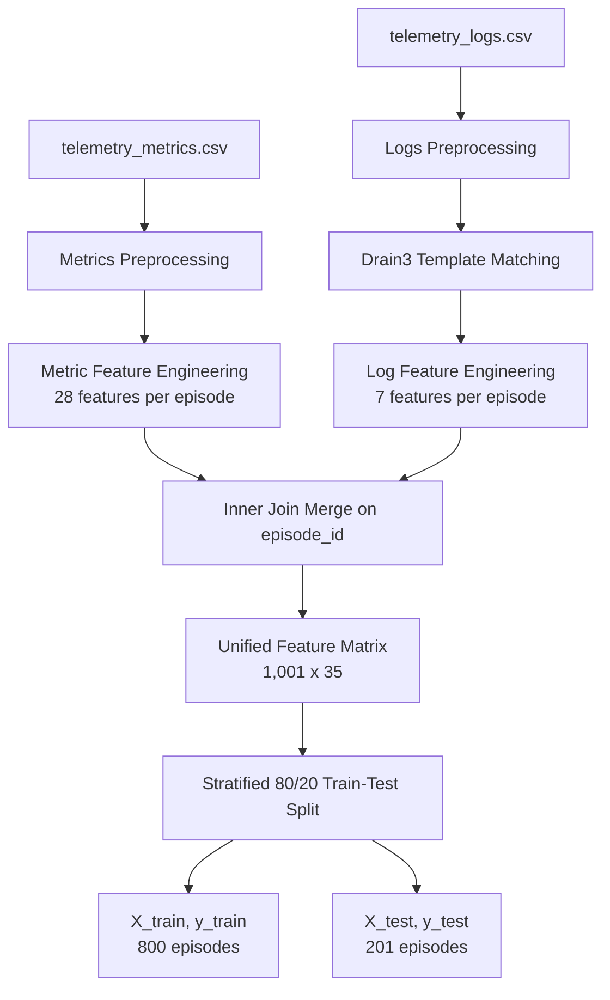

# AIOps Telemetry Platform & ML Pipeline

A unified telemetry collection, processing, and machine learning pipeline for automated IT systems failure diagnosis. The platform uses **Drain3 Log Template Mining** and statistical metric feature extraction to train classifiers targeting **13 distinct system failure modes**, and features a stateful, deterministic **Severity Engine** to classify and smooth incident severity (P1–P4).

---

## Project Structure

```text
DEVOPS/
├── severity_engine/            # Stateful Severity Engine package
│   ├── __init__.py             # Public API surface
│   ├── config.py               # lru_cached YAML configuration loader
│   ├── indicators.py           # Per-feature IndicatorLevel evaluations (30+ rules)
│   ├── aggregator.py           # Aggregates counts (critical, warning, blast size, etc.)
│   ├── rules.py                # 6-rule severity decision tree (first-match wins)
│   ├── smoother.py             # EMA + hysteresis temporal smoothing
│   ├── severity_engine.py      # Orchestrator & batch processing API
│   └── langgraph_node.py       # LangGraph-compatible SeverityNode
├── severity_config/
│   └── thresholds.yaml         # Externalized, data-calibrated thresholds
├── tests/                      # Pytest suite (105 test cases)
│   ├── test_indicators.py      # Boundary tests for all features
│   ├── test_aggregator.py      # Aggregation logic and weight adjustments
│   ├── test_rules.py           # 6-rule decision logic & reference scenarios
│   ├── test_smoother.py        # Temporal transition & independent state tests
│   └── test_severity_engine.py  # End-to-end integration & batch processor tests
├── docs/                       # Architecture and design diagrams
│   └── architecture.md
├── outputs/
│   └── Severity_Report.xlsx    # Formatted Excel report (120k rows)
├── data/
│   ├── telemetry_metrics.csv   # Raw telemetry metrics (120,120 rows)
│   ├── telemetry_logs.csv      # Raw telemetry logs (120,120 rows)
│   ├── telemetry_traces.csv    # Raw telemetry trace entries
│   └── ...                     # Processed splits & model assets
├── data_pipeline.py            # Phase 2: Combined metrics & logs pipeline + ML driver
├── generate_severity_excel.py  # Runs Severity Engine & generates formatted report
├── generate_hmm_states.py      # Time-series HMM state sequence generator
├── log_feature_engineering.py  # Independent log features extractor (spec-compliant)
├── generate_full_dataset.py    # Synthesizes raw metric, log, & trace CSVs
├── drain3.ini                  # Drain3 parser configuration
├── drain_state.bin             # Frozen Drain3 miner state snapshot
└── known_log_templates.json    # Discovered log template IDs
```

---

## 🛠️ Data Preparation Pipeline

The preprocessing workflow handles raw telemetry datasets (1,001 unique episodes in total) through the following pipeline:



### 1. Metric Features (28)
Extracted statistics (mean, max, std, trend slope, circuit breaker open ratio) over time windows within each episode:
* **CPU / Memory**: `cpu_mean`, `cpu_max`, `cpu_std`, `cpu_slope`, `memory_mean`, `memory_max`, `memory_growth_rate`, `heap_mean`, `heap_max`
* **Latency & RPS**: `p50_mean`, `p95_mean`, `p99_mean`, `latency_std`, `latency_slope`, `throughput_mean`, `throughput_std`
* **Cache / DB**: `cache_hit_ratio`, `cache_miss_rate`, `db_latency_mean`, `db_connections_max`
* **GC & Disk**: `gc_pause_mean`, `gc_pause_max`, `disk_read_mean`, `disk_write_mean`
* **Errors & Circuit Breaker**: `network_errors_mean`, `error_rate_mean`, `error_rate_max`, `cb_open_ratio`

### 2. Log Features (7)
Structured features representing logging profiles and parsing details:
* `log_count`, `log_max_severity`, `log_critical_count`, `log_has_exception`, `log_has_novel_template`, `log_exception_type_encoded`, `log_severity_ratio`

---

## 🚦 Severity Engine

The Severity Engine evaluates live telemetry steps or historical batches, applying business rules and temporal smoothing to calculate incident severity:

1. **Indicator Evaluation**: Maps raw metrics, logs, and trace features to `NORMAL`, `WARNING`, or `CRITICAL` based on data-calibrated thresholds defined in [thresholds.yaml](file:///d:/DEVOPS/severity_config/thresholds.yaml).
2. **Weight Escalation**: Failure-mode-specific weight overrides allow warning indicators to "round up" to critical during diagnostic evaluation (e.g. `cpu_utilization` gets a 1.5x multiplier during `CPU_SATURATION`).
3. **6-Rule Decision Tree**: Fiers top-to-bottom, evaluating critical counts, warning counts, blast size, cascade triggers (increasing distinct error services), and high-risk resource exhaustion features.
4. **Temporal Smoothing**: Applying an Alpha-weighted Exponential Moving Average (EMA) and a Hysteresis buffer (requiring 3 consecutive lower steps to de-escalate) avoids volatile severity transitions.
5. **LangGraph Interface**: Wraps the engine in a `SeverityNode` compatible with typed agent graph states.

---

## 🏆 Machine Learning Results

We trained three state-of-the-art classifier models on the preprocessed 35-feature matrix to diagnose **13 failure modes** (including `MEMORY_LEAK`, `CPU_SATURATION`, `BAD_DEPLOY`, `ERROR_STORM`, etc.).

### Accuracy Summary

| Classifier Model | Training Accuracy | Test Accuracy |
|------------------|-------------------|---------------|
| **Random Forest**| 100.00%           | **100.00%**   |
| **LightGBM**     | 100.00%           | **100.00%**   |
| **XGBoost**      | 100.00%           | **99.50%**    |

Confusion matrices and feature importance charts are stored under `data/`.

---

## 🚀 Running the Pipeline

### Prerequisites
Install all pipeline dependencies:
```bash
pip install drain3 scikit-learn pandas xgboost lightgbm matplotlib openpyxl xlsxwriter pytest pyyaml
```

### Run the Severity & Excel Report Generator
Processes the entire 120,120-row telemetry dataset, evaluates incident step severity, applies temporal smoothing, and outputs a formatted Excel workbook with color-coded severity sheets:
```bash
python generate_severity_excel.py
```
Output: [outputs/Severity_Report.xlsx](file:///d:/DEVOPS/outputs/Severity_Report.xlsx)

### Run the Tests Suite
Executes the comprehensive validation suite containing 105 automated unit and integration tests:
```bash
pytest tests/ -v
```

### Step 1: Re-train Drain3 Log Parser (Offline)
Trains the Drain3 parser on the training logs corpus to establish a baseline of known templates:
```bash
python offline/train_log_templates.py
```
Outputs: `known_log_templates.json` and `drain_state.bin`.

### Step 2: Run End-to-End Pipeline & Train ML Models
Performs combined feature extraction, matrix preparation, split, and ML model training:
```bash
python data_pipeline.py
```
This produces final datasets in `data/` and saves diagnostic evaluation plots.

