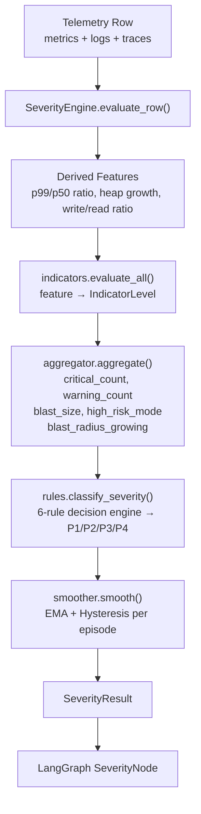

# Severity Engine — Architecture

## Overview

The Severity Engine is a modular, deterministic rule-based system that converts telemetry features (metrics, logs, traces) and a predicted failure mode into a severity label (P1/P2/P3/P4) with temporal smoothing.



## Module Responsibilities

| Module | Responsibility |
|---|---|
| `config.py` | Load `thresholds.yaml`, cache config, provide accessor helpers |
| `thresholds.py` (YAML) | Externalized warning/critical thresholds for all 30+ features |
| `indicators.py` | Per-feature stateless evaluation → `IndicatorLevel` |
| `aggregator.py` | Aggregate indicators into 5 rule-engine inputs |
| `rules.py` | 6-rule top-to-bottom severity decision, failure-mode floors |
| `smoother.py` | EMA + hysteresis temporal smoothing per episode |
| `severity_engine.py` | Orchestrator + batch `compute_severity(df)` |
| `langgraph_node.py` | LangGraph-compatible `SeverityNode` |

## Data Flow

```
telemetry_metrics.csv row
         │
         ▼
[1] Derived Feature Computation
    - p99_minus_p50_ratio = p99_latency / p50_latency
    - heap_growth_rate = heap_mb[t] - heap_mb[t-1]
    - write_read_latency_ratio = disk_write_latency / disk_read_latency
         │
         ▼
[2] Indicator Evaluation (per feature, stateless)
    - evaluate_cpu_utilization(value, cfg) → NORMAL|WARNING|CRITICAL
    - ... (30+ feature evaluators)
         │
         ▼
[3] Aggregation
    - critical_count  (features at CRITICAL, after weight escalation)
    - warning_count   (features at WARNING, after weight escalation)
    - blast_size      (critical + warning)
    - high_risk_mode  (any critical in: cpu, memory, error_rate, root_span_error, distinct_error)
    - blast_radius_growing (distinct_error_services grew since prev step)
         │
         ▼
[4] Rule Classification (first match wins)
    Rule 1: critical_count >= 2 OR (>=1 AND high_risk_mode) → P1
    Rule 2: blast_radius_growing AND critical_count >= 1    → P1
    Rule 3: critical_count == 1 AND NOT high_risk_mode      → P2
    Rule 4: warning_count >= 3 AND high_risk_mode           → P2
    Rule 5: warning_count >= 2 OR blast_size >= 4           → P3
    Rule 6: fallback                                         → P4
         │
         ▼
[5] Failure Mode Floor (BAD_DEPLOY: min P2)
         │
         ▼
[6] EMA Smoothing  (alpha=0.30)
    + Hysteresis   (3 consecutive lower readings to de-escalate)
         │
         ▼
    SeverityResult
```

## Key Design Principles

1. **Deterministic** — no ML in the severity engine, pure rule-based logic
2. **Modular** — every layer is independently testable
3. **Configurable** — all thresholds externalized in YAML; no code changes needed to tune
4. **Temporal** — EMA + hysteresis prevents impossible severity spikes and false recovery
5. **LangGraph-ready** — `SeverityNode` plugs directly into AgentState graph
